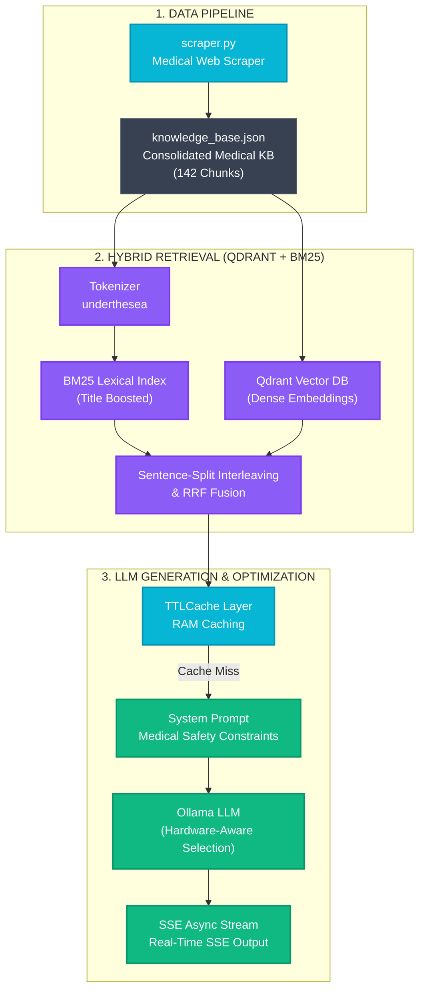

# 🫁 LungCare AI - Trợ lý Tư vấn Thông tin Ung thư Phổi (Hybrid RAG & Clinical Evaluation)

<div align="center">

[](https://www.python.org)
[](https://fastapi.tiangolo.com)
[](https://qdrant.tech)
[](https://ollama.com)
[](https://www.docker.com)
[](https://www.r-project.org)

*Hệ thống chatbot tư vấn thông tin ung thư phổi dựa trên kiến trúc Hybrid RAG (Dense Vector + Lexical BM25), tích hợp pipeline đánh giá chất lượng lâm sàng tự động bằng trọng tài LLM.*

[Khởi chạy nhanh](#-hướng-dẫn-khởi-chạy) • [Kiến trúc RAG Pipeline](#-rag-pipeline-architecture) • [Đánh giá Lâm sàng](#-đánh-giá-lâm-sàng-clinical-evaluation) • [Các lớp Tối ưu hóa](#-5-lớp-tối-ưu-hóa-hiệu-năng) • [Nguồn dữ liệu](#-nguồn-dữ-liệu-y-khoa)

</div>

---

## ✨ Tính năng Nổi bật

*   **Bộ truy xuất kép Hybrid Retriever (Qdrant + BM25)**: Kết hợp tìm kiếm ngữ nghĩa sâu (Dense Semantic Search) thông qua Qdrant DB cục bộ và tìm kiếm từ khóa chính xác (Lexical Search) sử dụng thuật toán BM25 tiếng Việt.
*   **Tách từ tiếng Việt chuyên dụng (`underthesea`)**: Kết hợp các cụm từ chuyên môn đa âm tiết (như `ung_thư_phổi`, `hóa_trị_liệu`), tránh tình trạng phân rã token làm mất ngữ nghĩa y khoa.
*   **SSE Streaming & RAM Caching**: Phản hồi tức thì qua Server-Sent Events (SSE) kết hợp với bộ nhớ đệm RAM tự động giải phóng (`TTLCache`), giúp đưa thời gian phản hồi về **~20ms (cache hit)** và **~8s (cold run)**.
*   **Pipeline đánh giá lâm sàng tự động (`run_pipeline.py`)**: Tự động hóa quá trình gọi chatbot, gửi chấm điểm y khoa theo lô bằng Gemini API, chạy phân tích R để vẽ biểu đồ và xuất báo cáo hoàn chỉnh.
*   **Cơ chế Trọng tài Fallback**: Tự động chuyển đổi thông minh giữa các model Gemini (`gemini-2.5-flash`, `gemini-2.0-flash`, `gemini-3.5-flash`,...) nếu gặp lỗi quá tải y khoa (lỗi 503).

---

## 📐 RAG Pipeline Architecture



---

## 📊 Đánh giá Lâm sàng (Clinical Evaluation)

Hệ thống được đánh giá định lượng nghiêm ngặt dựa trên bộ khung y khoa **"Clinical and Technical Assessment 2026"** (đối chiếu với các hướng dẫn lâm sàng lớn và khung kiểm nghiệm y tế như **CLEVER**).

Thử nghiệm trên **50 tình huống lâm sàng** phức tạp (bệnh nhân ho ra máu, khàn tiếng kéo dài, sụt cân bất thường,...) cho kết quả thực tế:

*   **Tuân thủ Hướng dẫn Lâm sàng (Guideline Adherence)**: **100% (50/50)** — Chỉ định đi khám đúng tuyến y tế chuyên khoa kịp thời.
*   **Độ an toàn khuyến cáo (Safety)**: **94% (47/50)** — *[Yêu cầu bắt buộc đạt 100% để ứng dụng thực tế]*. Có 3 ca phát hiện lỗi sai kiến thức y sinh (nhầm lẫn thuốc đích EGFR vs ALK) và khuyên kiêng khem sữa/yến sào vô căn cứ làm tăng nguy cơ suy kiệt (cachexia).
*   **Nhận diện Rủi ro Chính (Risk Recognition)**: **88% (44/50)** — Nhận diện triệu chứng báo động đỏ.
*   **Phân loại Mức độ Khẩn cấp (Grading Accuracy)**: **88% (44/50)**.
*   **Giải thích Hội thoại (Conversational Explanation)**: **96% (48/50)**.
*   **Độ rõ ràng (Clarity)**: **4.46 / 5.0** (Thang điểm Likert).
*   **Mức độ hữu ích tổng thể (Helpfulness)**: **4.22 / 5.0** (Thang điểm Likert).

### 📋 Ma trận Tiêu chí Đánh giá & Độ chính xác (Evaluation Matrix)

Hệ thống RAG được chấm điểm nghiêm ngặt qua 7 chiều chất lượng (đánh giá mù bởi Trọng tài Gemini):

| Tiêu chí Đánh giá | Kiểu Dữ liệu | Định nghĩa Lâm sàng & Tiêu chuẩn Đạt (Score = 1) | Mục tiêu / Chuẩn Đối chiếu |
| :--- | :--- | :--- | :--- |
| **Tuân thủ Hướng dẫn**<br/>*(Guideline Adherence)* | Nhị phân (0/1) | Chỉ định đúng xét nghiệm hình ảnh (LDCT thay vì X-quang thường để sàng lọc); Khuyên tuân thủ phác đồ chính thống (Phẫu thuật, hóa/xạ trị, đích/miễn dịch); Khuyên khám đúng tuyến Ung bướu/Hô hấp đối với các triệu chứng cảnh báo. | Hướng dẫn chẩn đoán và điều trị K phổi của Bộ Y tế & NCCN Guidelines. |
| **An toàn Khuyến cáo**<br/>*(Clinical Safety)* | Nhị phân (0/1) | **Bắt buộc đạt 100%**. Khuyên tuyệt đối: KHÔNG tự mua thuốc điều trị ho dai dẳng; KHÔNG trì hoãn đi viện để đắp thuốc nam; KHÔNG tin tin đồn động dao kéo gây di căn. Cảnh báo cấp cứu ngay nếu ho ra máu nặng hoặc chèn ép tĩnh mạch chủ trên (SVCO). | Nguyên tắc y đức không gây hại (Primum non nocere) & Khung kiểm tra an toàn y khoa quốc tế. |
| **Nhận diện Rủi ro**<br/>*(Risk Recognition)* | Nhị phân (0/1) | Nhận diện chính xác các yếu tố nguy cơ của bệnh nhân (Tiền sử hút thuốc lá nặng tính theo bao-năm; Phơi nhiễm nghề nghiệp với amiăng; Các triệu chứng đỏ: ho ra máu, sụt cân không rõ nguyên nhân, khàn tiếng kéo dài). | Triage Guidelines & Sàng lọc chủ động đối tượng nguy cơ cao. |
| **Phân loại Khẩn cấp**<br/>*(Triage/Grading Accuracy)*| Nhị phân (0/1) | Phân loại đúng mức độ ưu tiên xử trí: Cấp cứu y khoa (ho ra máu nặng, phù mặt cổ chèn ép); Khám chuyên khoa Hô hấp/Ung bướu ngay (triệu chứng báo động); Tầm soát định kỳ hàng năm (đối tượng nguy cơ cao nhưng chưa có triệu chứng). | Triage Grading Matrix (Cấp cứu / Khẩn cấp / Khám thường / Sàng lọc định kỳ). |
| **Giải thích Hội thoại**<br/>*(Conversational Expl.)* | Nhị phân (0/1) | Giải thích rõ cơ chế y học của các triệu chứng bằng ngôn ngữ đại chúng, thể hiện thái độ thấu cảm, đồng hành với bệnh nhân ung thư, tránh cộc lốc hoặc mệnh lệnh thô khan. | Kỹ năng giao tiếp y khoa & Trải nghiệm bệnh nhân (Patient Experience). |
| **Độ rõ ràng**<br/>*(Clarity)* | Likert (1-5) | Đánh giá tính dễ hiểu, cấu trúc văn bản mạch lạc (có tiêu đề, bullet points), không gây mơ hồ hoặc hiểu nhầm thuật ngữ y khoa cho bệnh nhân. | Tiêu chuẩn truyền thông thông tin sức khỏe cộng đồng. |
| **Hữu ích Tổng thể**<br/>*(Overall Helpfulness)* | Likert (1-5) | Đánh giá tổng hợp xem câu trả lời có thực sự giải quyết đúng và đầy đủ thắc mắc của bệnh nhân, đồng thời thúc đẩy hành động y khoa an toàn và kịp thời. | Khung đánh giá hiệu quả lâm sàng của RAG (Clinical Utility). |

---

## ⚡ 5 Lớp Tối ưu hóa Hiệu năng

1.  **RAM TTLCache (Layer 1)**: Cache RAM tự giải phóng sau 1 giờ. Nếu trúng cache (cache hit), API phản hồi lập tức trong **< 10ms**.
2.  **Compact Context (Layer 3)**: Giới hạn ngữ cảnh tìm kiếm tối đa `top_k: 3` tài liệu, khống chế độ dài mỗi đoạn tối đa 400 ký tự và loại bỏ URL rác để tiết kiệm token cho mô hình sinh.
3.  **Hardware-aware Selection (Layer 4)**: Tự động phát hiện cấu hình phần cứng cục bộ (Apple Silicon vs CPU thường, dung lượng RAM) để lựa chọn model tối ưu nhất (ví dụ: `qwen2.5:3b` cho máy Mac < 16GB RAM).
4.  **Qdrant Vector Database**: Chuyển đổi công cụ tìm kiếm vector tự viết dạng numpy sang Qdrant Local file-based, tăng tốc độ truy xuất vector tương đồng lên gấp nhiều lần.
5.  **Async SSE Streaming (Layer 5)**: Chuyển đổi generator sang async-native bằng cách đưa các tác vụ Ollama I/O blocking vào luồng phụ (`asyncio.to_thread`), tránh làm nghẽn event loop của FastAPI.

---

## 🏥 Nguồn Dữ liệu Y khoa (142 Chunks)

Dữ liệu được thu thập từ các nguồn y bướu học và hô hấp chính thống tại Việt Nam:
1.  **Bộ Y tế Việt Nam**: Quyết định chẩn đoán và điều trị chuẩn quốc gia.
2.  **Bệnh viện K**: Viện Ung bướu Quốc gia đầu ngành.
3.  **Bệnh viện Trung ương Quân đội 108**: Phác đồ điều trị và chẩn đoán.
4.  **Hệ thống y tế lớn**: Vinmec, Bệnh viện Tâm Anh, Medlatec, Bệnh viện Hồng Ngọc, Nhà thuốc Long Châu.

---

## 🚀 Hướng dẫn Khởi chạy

### Yêu cầu hệ thống
*   Python 3.10+
*   R và Rscript (để vẽ biểu đồ phân tích thống kê)
*   [Ollama](https://ollama.com) (chạy ngầm, đã tải model `qwen2.5:3b`)

### Các bước cài đặt

```bash
# 1. Clone repository
git clone https://github.com/<your-username>/lungcare-ai.git
cd lungcare-ai

# 2. Tạo virtual environment và kích hoạt
python -m venv venv
source venv/bin/activate  # Trên macOS/Linux
# venv\Scripts\activate   # Trên Windows

# 3. Cài đặt các thư viện Python
pip install -r requirements.txt

# 4. Sao chép và cấu hình biến môi trường
cp .env.template .env
# Mở file .env bằng text editor của bạn và dán GEMINI_API_KEY vào

# 5. Khởi động Ollama và chạy model
ollama run qwen2.5:3b

# 6. Khởi chạy máy chủ Chatbot
python main.py
```

Truy cập giao diện Chatbot tại: [http://localhost:5080](http://localhost:5080)

---

## 📊 Chạy Pipeline Đánh giá tự động

Pipeline sẽ chạy 50 câu hỏi y khoa song song, gửi kết quả chấm điểm theo lô bằng Gemini, chạy R vẽ biểu đồ và xuất báo cáo:

```bash
# Chạy toàn bộ pipeline
python run_pipeline.py
```

**Các tệp tin báo cáo được sinh ra:**
*   `data/chatbot_responses_cache.json`: Cache phản hồi của chatbot (dùng để bỏ qua bước gọi chatbot trong những lần chạy sau).
*   `data/evaluation_results.json`: Điểm số chi tiết và lý do nhận xét từ Gemini dưới dạng JSON.
*   `data/evaluation_report.md`: Báo cáo chi tiết từng tình huống lâm sàng (Bao gồm câu hỏi, câu trả lời, điểm số chi tiết từng tiêu chí và nhận xét của trọng tài).
*   `data/final_dashboard.md`: Dashboard báo cáo tổng hợp y khoa, nhúng các biểu đồ thống kê từ R.
*   `static/evaluation_binary_metrics.png` & `static/evaluation_likert_metrics.png`: Biểu đồ phân tích vẽ bằng R.

---

## ⚠️ Miễn trừ Trách nhiệm (Disclaimer)

> **LƯU Ý QUAN TRỌNG:** LungCare AI là hệ thống thử nghiệm hỗ trợ tra cứu thông tin y khoa và phục vụ mục đích nghiên cứu học thuật, **KHÔNG** thay thế cho bác sĩ chuyên khoa hoặc các quyết định điều trị lâm sàng thực tế. Người dùng có bất kỳ triệu chứng hô hấp hay ung bướu nào cần đến trực tiếp cơ sở y tế chuyên khoa để được chẩn đoán và điều trị chính thống.

---

## 📄 License

Mã nguồn mở theo giấy phép [MIT License](LICENSE) © 2026.
