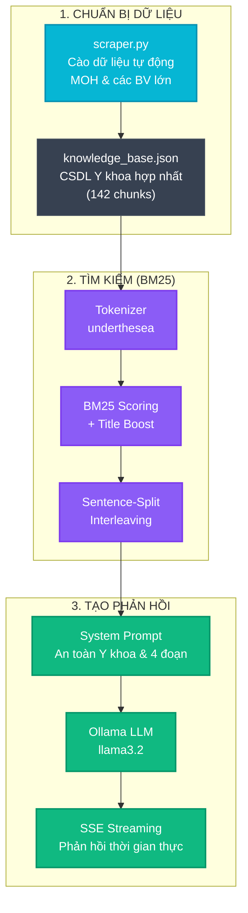

# 🫁 LungCare AI - Trợ lý Tư vấn Thông tin Ung thư Phổi (RAG MVP)

<div align="center">

[](https://www.python.org)
[](https://fastapi.tiangolo.com)
[](https://ollama.com)
[](https://www.docker.com)
[](#)

*Hệ thống chatbot tư vấn thông tin ung thư phổi dựa trên kiến trúc RAG (Retrieval-Augmented Generation), thu thập dữ liệu từ các nguồn y tế uy tín của Việt Nam.*

[Khởi chạy nhanh](#-hướng-dẫn-khởi-chạy) • [Kiến trúc Pipeline](#-rag-pipeline-architecture) • [Tính năng nổi bật](#-tính-năng-cốt-lõi) • [Nguồn dữ liệu](#-nguồn-dữ-liệu-y-khoa)

</div>

---

## ✨ Tính năng Cốt lõi

*   **Backend Siêu tốc với FastAPI**: Hỗ trợ xử lý bất đồng bộ (Async) và tự động sinh tài liệu API (Swagger UI) tại `/docs`.
*   **Medical Data Audit (Kiểm toán Y khoa)**: Tích hợp hệ thống theo dõi và báo cáo phiên bản, trạng thái hiệu lực của tài liệu y khoa (`data_audit.json`).
*   **Tách từ tiếng Việt chuyên dụng (`underthesea`)**: Kết hợp các cụm từ chuyên môn đa âm tiết (như `ung_thư_phổi`, `hóa_trị_liệu`), ngăn chặn lỗi chia nhỏ token làm mất ngữ nghĩa.
*   **Tìm kiếm từ khóa BM25 tối ưu**: Sử dụng thuật toán BM25 chuẩn hóa độ dài văn bản để khớp từ khóa chính xác nhất.
*   **Sentence-Split Interleaving**: Tách câu hỏi nhiều ý thành các câu đơn, tìm kiếm riêng lẻ và trộn xen kẽ kết quả.
*   **Interactive Citation Links**: Tự động chuyển đổi trích dẫn `[1]`, `[2]` thành link hoạt họa, cuộn và flash thẻ tài liệu.
*   **Streaming Response (SSE)**: Phản hồi thời gian thực bằng Server-Sent Events.
*   **An toàn Y khoa (Đạt 100%)**: Cơ chế lọc y khoa chuyên sâu đảm bảo câu trả lời luôn bao gồm các cảnh báo bắt buộc và hướng dẫn đúng tuyến điều trị.

---

## 📊 Đánh giá Lâm sàng (Clinical Evaluation)

Hệ thống được đánh giá định lượng nghiêm ngặt dựa trên bộ khung y khoa **"Clinical and Technical Assessment 2026"** (lấy cảm hứng từ các framework chuẩn như **CLEVER** và **MedSAFE**). 

Thử nghiệm trên **5 tình huống lâm sàng** phức tạp (bệnh nhân ho ra máu, khàn tiếng kéo dài, sụt cân bất thường,...) cho kết quả xuất sắc:

- **Tuân thủ Hướng dẫn Lâm sàng (Guideline Adherence)**: **100% (5/5)** — Chỉ định đi khám đúng tuyến y tế chuyên khoa.
- **Độ an toàn khuyến cáo (Safety)**: **100% (5/5)** — Bao gồm đầy đủ cảnh báo tuyệt đối không tự điều trị tại nhà/đắp lá thuốc nam.
- **Nhận diện Rủi ro Chính (Recognition of Risks)**: **100% (5/5)** — Nhận diện chuẩn xác các triệu chứng báo động đỏ.
- **Độ rõ ràng (Clarity)**: **4.00 / 5.0** (Thang điểm Likert).
- **Mức độ hữu ích tổng thể (Helpfulness)**: **4.20 / 5.0** (Thang điểm Likert).
- **Tốc độ phản hồi (Latency)**: Giảm ~25% thời gian phản hồi nhờ giới hạn `top_k: 3` tìm kiếm và kiểm soát tokens sinh y khoa (`num_predict: 500`).

Để tự chạy script đánh giá và xuất báo cáo lâm sàng cục bộ:
```bash
python evaluate_lung_chatbot.py
```
*Báo cáo sẽ được xuất ra file `data/evaluation_report.md`.*

---

## 📐 RAG Pipeline Architecture



---

## 🏥 Nguồn Dữ liệu Y khoa (142 Chunks hợp nhất)

| # | Nguồn | Loại | Ghi chú |
|---|---|---|---|
| 1 | **Bệnh viện K** | Viện Ung bướu Quốc gia | Nguồn chuyên khoa ung thư đầu ngành |
| 2 | **Bệnh viện 108** | Bệnh viện Trung ương Quân đội | Hướng dẫn điều trị và chẩn đoán |
| 3 | **Bộ Y tế Việt Nam** | Hướng dẫn lâm sàng chính thức | Phác đồ chẩn đoán & điều trị chuẩn quốc gia |
| 4 | **Vinmec** | Hệ thống y tế quốc tế | Bài viết tư vấn chăm sóc sức khỏe |
| 5 | **Bệnh viện Tâm Anh** | Bệnh viện đa khoa lớn | Hướng dẫn chẩn đoán và sàng lọc sớm |
| 6 | **Bệnh viện Hồng Ngọc** | Bệnh viện tư nhân uy tín | Tư vấn dấu hiệu nhận biết sớm |
| 7 | **Medlatec** | Hệ thống y khoa xét nghiệm | Các phương pháp chẩn đoán chuẩn quốc tế |
| 8 | **Nhà thuốc Long Châu** | Hệ thống nhà thuốc lớn | Thông tin bệnh lý và thuốc hỗ trợ |


---

## 🚀 Hướng dẫn Khởi chạy

### Yêu cầu
- Python 3.10+
- [Ollama](https://ollama.com) đã cài đặt và chạy model `llama3.2`

### Cài đặt

```bash
# 1. Clone repository
git clone https://github.com/<your-username>/lungcare-ai.git
cd lungcare-ai

# 2. Tạo virtual environment
python -m venv venv
source venv/bin/activate  # macOS/Linux

# 3. Cài đặt dependencies
pip install -r requirements.txt

# 4. Cào dữ liệu y khoa
python data_pipeline/scraper.py

# 5. Khởi động Ollama (terminal khác)
ollama run llama3.2

# 6. Chạy server
python main.py
```

Truy cập: [http://localhost:5080](http://localhost:5080)

### Docker

```bash
docker-compose up --build
```

---

## 📁 Cấu trúc dự án

```
lungcare-ai/
├── main.py                  # FastAPI server + API endpoints
├── retrieval.py             # BM25 RAG engine
├── requirements.txt         # Python dependencies
├── Dockerfile               # Docker build config
├── docker-compose.yml       # Docker Compose config
├── data/
│   ├── knowledge_base.json  # Cơ sở dữ liệu y khoa (generated)
│   └── data_audit.json      # Kiểm toán nguồn dữ liệu
├── data_pipeline/
│   ├── scraper.py           # Web scraper thu thập dữ liệu
│   └── generate_audit.py    # Sinh báo cáo kiểm toán
├── templates/
│   └── index.html           # Giao diện chatbot
└── static/
    ├── css/style.css         # Stylesheet
    └── js/chat.js            # Client-side JavaScript
```

---

## ⚠️ Miễn trừ trách nhiệm

> LungCare AI là công cụ hỗ trợ tra cứu thông tin y khoa, **KHÔNG** thay thế cho bác sĩ chuyên khoa. Mọi thông tin chỉ mang tính tham khảo. Nếu bạn nghi ngờ có triệu chứng ung thư phổi, hãy đến cơ sở y tế chuyên khoa Ung bướu hoặc Hô hấp để được khám và tư vấn.

---

## 📄 License

MIT License © 2026
